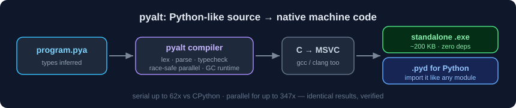

<p align="center"></p>

# pyalt

[](https://github.com/nabaalghad/pyalt/actions/workflows/ci.yml)

pyalt is a small compiled language with Python-like syntax. It compiles
source files to standalone native executables, or to extension modules that
can be imported from Python. There is no GIL; `parallel for` distributes a
loop across CPU cores, and writes to shared state inside a parallel loop
are rejected at compile time.



## Benchmarks

A Monte Carlo trading backtest: 200 simulated price paths × 50,000 steps,
an EMA-crossover strategy with stop-losses. 10 million loop iterations with
per-step state, which prevents NumPy vectorization. Identical logic in each
implementation; all produce byte-identical output. Median of 5 runs,
Windows 11 x64, CPython 3.11.

| implementation | serial | parallel | notes |
|---|---|---|---|
| CPython 3.11 | 3.088 s | — | GIL prevents thread parallelism |
| Numba 0.59 `@njit` | 0.041 s | 0.0068 s (`prange`) | ~2.2 s JIT compile on first call; `prange` data races are not detected |
| pyalt | 0.049 s | 0.0089 s | ahead-of-time; no warmup; race conditions are compile errors |

Numba is 15–25% faster at steady state on this workload. pyalt differs in
kind rather than degree: it compiles whole programs (not decorated
functions), produces executables that run without Python installed, and
rejects shared-state races at compile time. Comparisons against Codon and
free-threaded CPython have not been run yet; the benchmark script is at
[bench/mc_numba_comparison.py](bench/mc_numba_comparison.py).

Serial string- and dict-heavy code is a weaker case: roughly 2.5–5x over
CPython, whose string and dict internals are already optimized C.
`parallel for` reached 15x on the same text workload. Full results and
methodology: [BENCHMARKS.md](BENCHMARKS.md), reproducible with
`python bench/harness.py`, which also verifies that pyalt's outputs equal
CPython's.

```python
class Result:
    equity: float
    trades: int
    wins: int

def run_path(seed: int, steps: int) -> Result:   # parameters are annotated;
    price = 100.0                                 # everything else is inferred
    ...
    return Result(equity, trades, wins)

parallel for p in range(paths):
    r = run_path(p + 1, steps)
    eqs[p] = r.equity                             # distinct slots; no race
```

## Installation (Windows)

1. Download `pyalt-0.1.0-windows-x64.zip` from [Releases](../../releases)
   and unzip it anywhere, e.g. `C:\pyalt`.
2. Either call the compiler by path — `C:\pyalt\bin\pyalt.exe` — or add
   `C:\pyalt\bin` to your user `Path` environment variable so the `pyalt`
   command works everywhere. The included `install.ps1` performs that PATH
   addition for you; note that Windows requires downloaded scripts to be
   run explicitly: `powershell -ExecutionPolicy Bypass -File .\install.ps1`.
   After a PATH change, open a new terminal.
3. Building programs requires a C compiler on the machine: MSVC
   ([VS Build Tools](https://visualstudio.microsoft.com/visual-cpp-build-tools/)),
   gcc, or clang — detected automatically.

Create `hello.pya`:

```python
def fib(n: int) -> int:
    if n < 2: return n
    return fib(n - 1) + fib(n - 2)

print(f"fib(30) = {fib(30)}")
```

```
pyalt run hello.pya          # compile and run
pyalt build hello.pya        # produces build\hello.exe (~200 KB, no dependencies)
pyalt buildpy hello.pya      # produces build\hello.pyd for import from Python
```

To run from source instead of the release: `python pyalt.py run hello.pya`
(Python 3.10+).

Linux and macOS: the toolchain detects gcc/clang and the runtime has POSIX
paths; run from source with `python3 pyalt.py run hello.pya`. The full test
suite passes on Ubuntu in CI. Less field-tested than Windows.

## Language

Covered by 216 tests, which CI runs on Windows and Linux:

- Types: `int`, `float`, `bool`, `str`, `list[T]`, `dict[K,V]`, `set[T]`
  (insertion-ordered), and user-defined classes with methods. Function
  parameters are annotated; all other types are inferred at compile time.
- Exceptions: `try` / `except as msg` / `raise`. Runtime errors — bounds,
  division by zero, missing keys, file errors — are catchable.
- Modules: `import utils` or `from utils import clean`; the import graph
  compiles into one binary; cycles are compile errors.
- `parallel for` over ranges, lists, strings, dicts, sets. The compiler
  rejects assignments to outer variables and structural mutation of shared
  containers inside the loop body; results are written to distinct
  output-list slots.
- Memory: a conservative mark-sweep garbage collector. `gc_collect()`
  builtin; `PYA_GC`, `PYA_GC_MIN`, `PYA_THREADS` environment variables.
- CLI builtins: `args()`, `input()`, `exists()`, `exit()`.
  [examples/csvstat.pya](examples/csvstat.pya) is a working group-by
  statistics tool built from them.
- Python interop: compiled modules convert `int`, `float`, `bool`, `str`,
  `list`, `dict`, `set` at the boundary; runtime errors surface as
  `RuntimeError`, argument type errors as `TypeError`.

Compile errors carry position and a suggestion:

```
prog.pya:3:19: error: '+' has mismatched operand types: int and str — to
build a string, convert with str(...) or use an f-string
        total = total + line
                      ^
```

## Semantic differences from Python

pyalt has Python-like syntax, not identical semantics. The differences that
matter:

- `int` is 64-bit machine precision, not arbitrary precision. `10**19`
  overflows in pyalt and works in Python. Values beyond ±9.2×10¹⁸ are
  outside pyalt's current integer range.
- Strings are UTF-8 byte sequences: `len()`, indexing, and slicing count
  bytes. Identical to Python for ASCII; different for non-ASCII text.
- `float` is IEEE-754 double and matches CPython arithmetic bit-for-bit
  (verified by the benchmark harness); `//` and `%` follow Python's
  floor/sign rules. Float *formatting* can differ from Python's `repr` in
  edge cases.
- Errors are messages, not exception objects. `except` catches everything;
  there is no exception class hierarchy yet.
- No `None`; conditions must be `bool`; a variable keeps one type. These
  are compile errors rather than silent differences.

## Architecture



```
prog.pya → lexer → parser → type checker → C emitter → MSVC/gcc/clang → native code
```

The compiler (~3,700 lines) is currently written in Python — the usual
bootstrap arrangement for a new language. The release package is
self-contained and does not require Python; compiled output never involves
Python. The runtime is a single C header (~1,300 lines): garbage collector,
insertion-ordered hash tables with cached string hashes, zero-copy string
views, thread pool, bounds checks throughout, Python-compatible `//` and
`%` semantics.

## Limitations

- No class inheritance, exception types, tuples, closures, or `None` yet.
  Recursive class types type-check, but building linked structures requires
  the planned Optional type.
- Class instances do not cross the Python boundary and cannot be printed
  directly.
- Imported modules contain functions and classes only; no top-level code
  runs on import.
- Serial string/dict workloads gain roughly 2.5–5x, bounded by CPython's
  already-optimized internals.
- Young project; Windows is the primary platform.

## Roadmap

In order: NumPy array interop (zero-copy), Linux support promoted from
experimental, `None`/Optional, class inheritance, self-hosted compiler,
bundled C backend.

MIT license. Development practice: no change merges without tests, and the
benchmark harness verifies pyalt's outputs against CPython's on every run.
